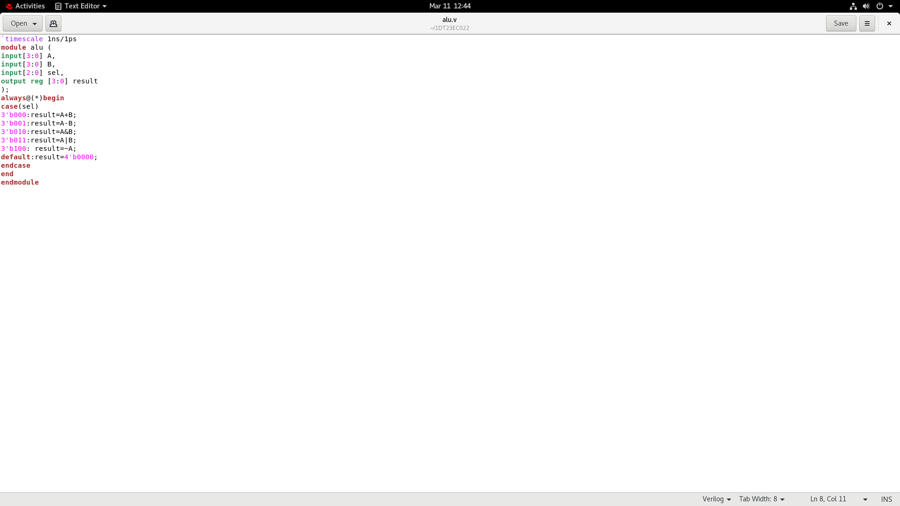
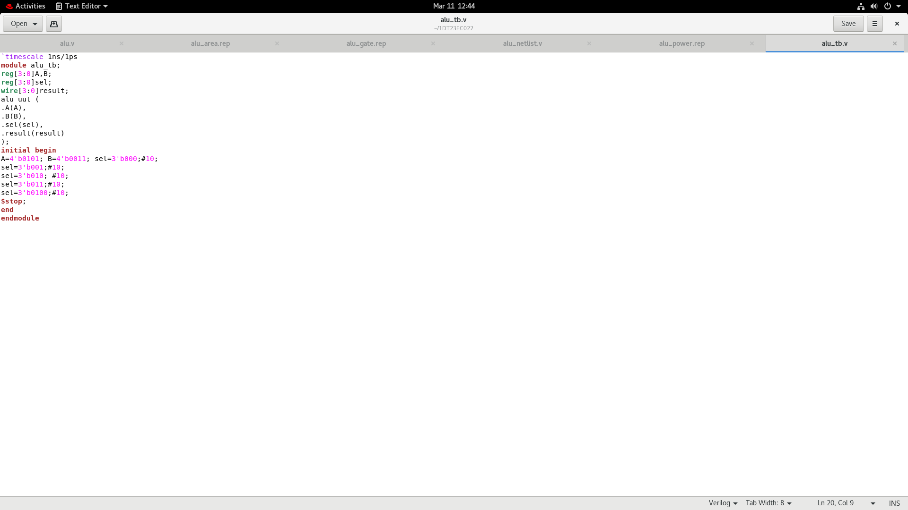
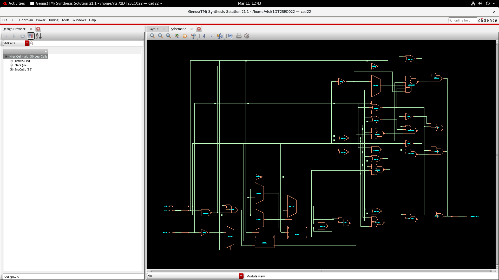
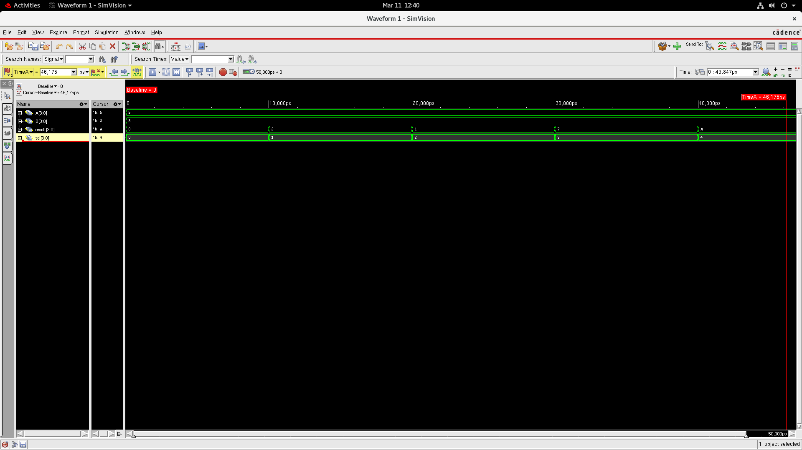
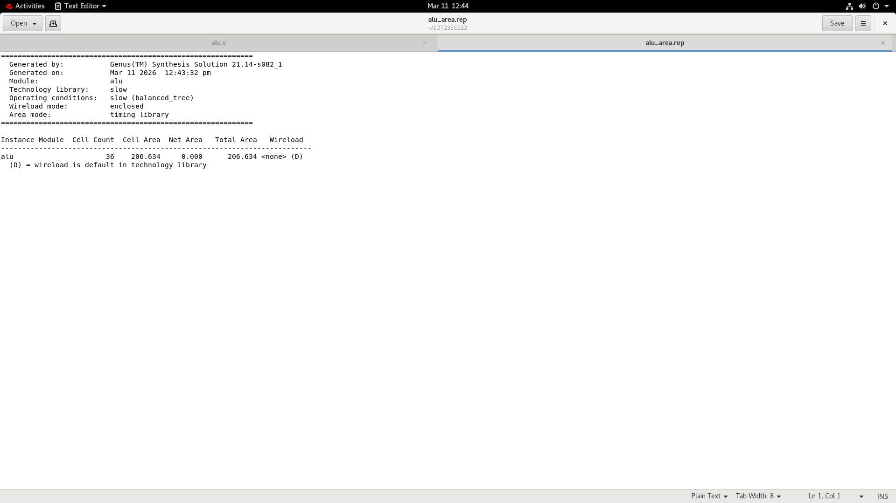
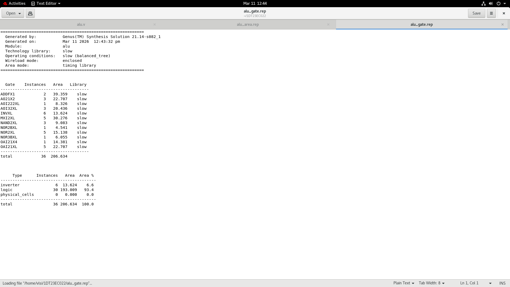
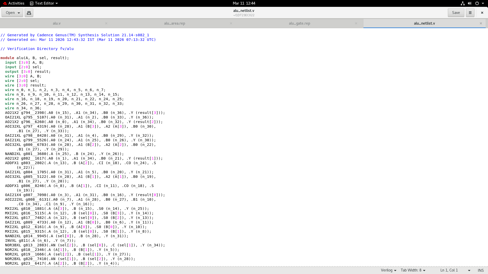
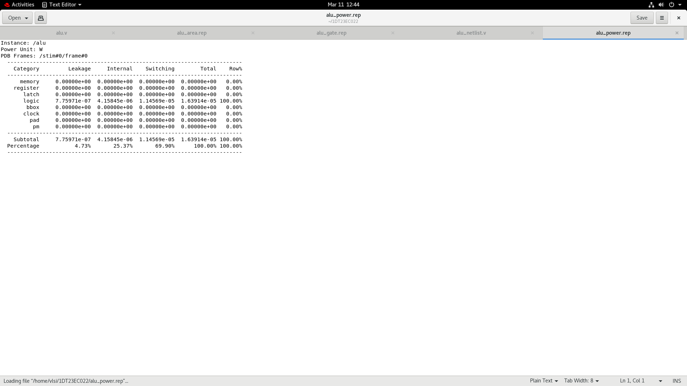
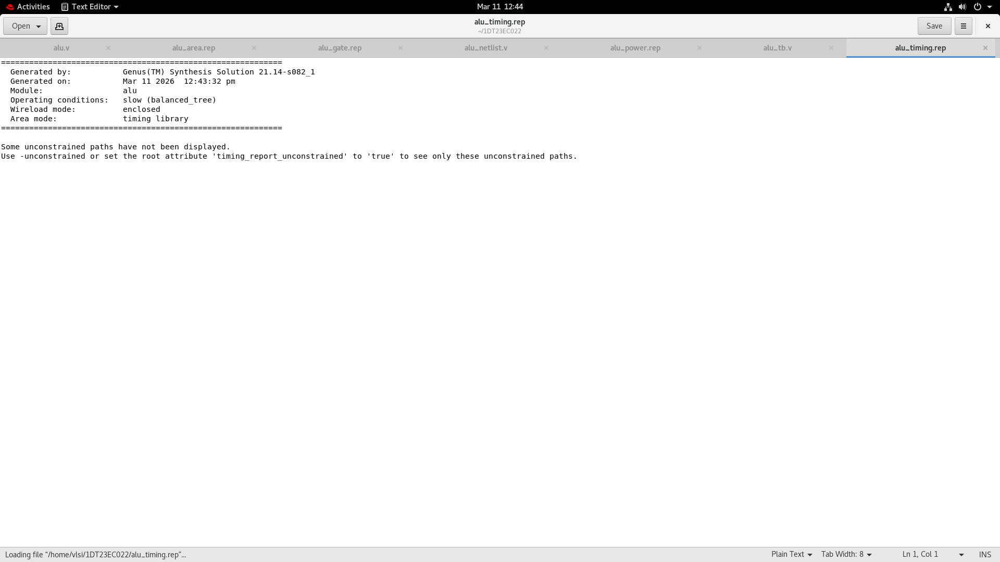

# Project 1 – Arithmetic Logic Unit (ALU)

This project implements an **Arithmetic Logic Unit (ALU)** using **Verilog HDL** and simulation/synthesis using Cadence tools.  
The ALU is a core component in processors responsible for performing arithmetic and logical operations on binary data.

---

# Verilog Implementation

## ALU Verilog Code

This file contains the **RTL implementation of the ALU in Verilog HDL**.  
The module defines the input operands, control signals, and output results. The design implements arithmetic and logical operations based on the selected operation code.

---

## Testbench Code

The testbench is used to **verify the functionality of the ALU** by applying different combinations of input signals.  
It generates stimulus for the ALU module and observes the resulting outputs to ensure correct operation.

---

# Design Outputs

## Synthesized ALU Schematic

This schematic represents the **hardware-level implementation of the ALU after synthesis**.  
It shows the logic gates and connections generated by the synthesis tool from the Verilog RTL description.

---

## Simulation Output

This waveform shows the **simulation results of the ALU design**.  
Different input combinations are applied, and the output waveform verifies that the ALU performs the intended arithmetic and logical operations correctly.

---

# Synthesis Reports

## Area Report

The area report provides information about the **hardware resources used by the ALU design**, including the total cell area and resource utilization after synthesis.

---

## Gate Report

The gate report lists the **number and types of logic gates** used in the synthesized design.  
This helps in understanding the hardware complexity of the ALU.

---

## Netlist Report

The netlist report shows the **structural representation of the synthesized design**, including all logic components and their interconnections.

---

## Power Report

This report provides an estimate of the **power consumption of the ALU**, including dynamic and leakage power components.

---

## Timing Report

The timing report analyzes the **propagation delays and timing paths** in the ALU design to ensure that it meets the required clock timing constraints.

---

# Tools Used

- Verilog HDL  
- Cadence Digital Design Tools  
- RTL Design and Synthesis  

---

# Author

**Dhruthi S**  
B.E. Electronics and Communication Engineering
