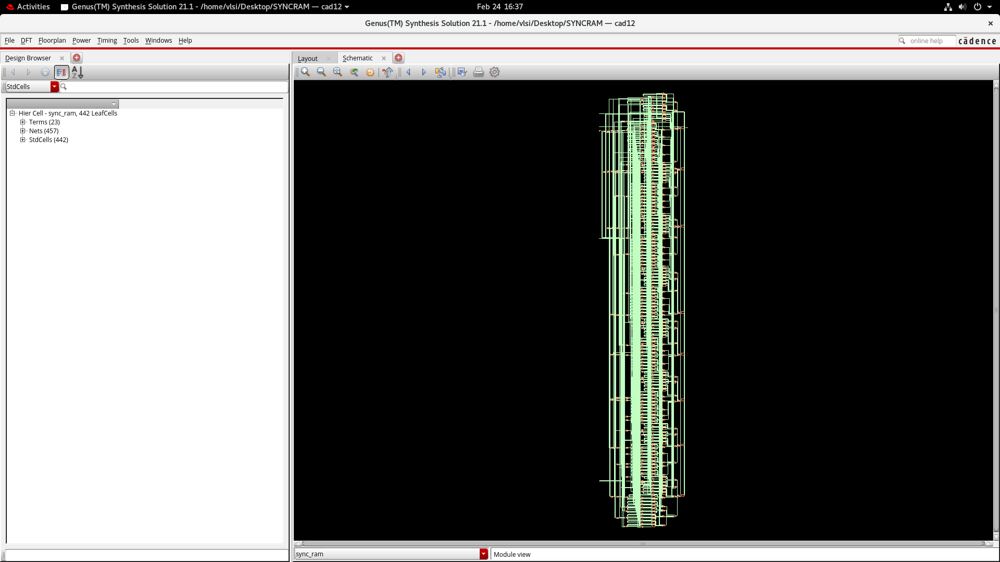
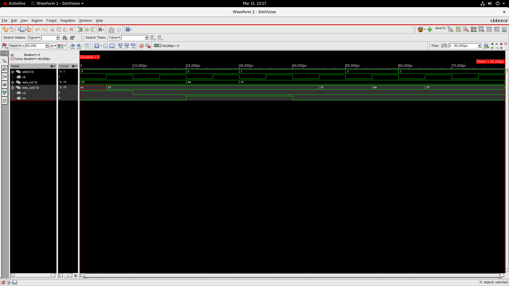

# Project 2 – RAM Design

This project implements a **Synchronous Random Access Memory (RAM)** using **Verilog HDL** and verified through simulation and synthesis using Cadence digital design tools.

RAM is an essential component in digital systems and processors, used for **temporary data storage and fast data access**. This design demonstrates how memory elements can be described at the **Register Transfer Level (RTL)** and synthesized into hardware.

---

# Verilog Implementation

## RAM Module

The Verilog implementation of the RAM module is available in:

```
Source_code/syncram.v
```

This module describes the **memory architecture**, including:

- Address input
- Data input and output
- Clock signal
- Read/Write control

The design follows a **synchronous memory architecture**, where read and write operations occur with respect to the clock signal.

---

## Testbench Code

The testbench used to verify the functionality of the RAM design is located at:

```
Source_code/syncram_tb.v
```

The testbench applies different **address and data inputs** to simulate memory operations such as:

- Writing data into memory
- Reading stored data from memory
- Verifying correct memory behavior during clock transitions

---

# Design Outputs

## Synthesized RAM Schematic



This schematic represents the **hardware-level implementation of the RAM after synthesis**.  
It shows the internal logic structure generated from the Verilog RTL design, including storage elements, logic gates, and interconnections used to implement the memory functionality.

---

## Simulation Waveform



The simulation waveform demonstrates the **functional verification of the RAM module**.  
The waveform shows how data is written into specific memory locations and later read back correctly when the corresponding address is accessed.

Key signals observed in the simulation include:

- Clock signal
- Address lines
- Data input
- Data output
- Read/Write control signals

---

# Synthesis Reports

The synthesis reports provide detailed information about the **hardware implementation and performance characteristics** of the RAM design.

---

## Area Report

File:

```
Synthesis_Report/RAM_area.rep
```

This report provides details about the **hardware area consumed by the synthesized design**, including:

- Total cell area
- Resource utilization
- Standard cell usage

Area analysis helps evaluate the **hardware efficiency of the memory design**.

---

## Gate Report

File:

```
Synthesis_Report/RAM_gate.rep
```

The gate report lists the **number and types of logic gates used in the synthesized circuit**.

This information helps analyze the **complexity and structure of the hardware implementation**.

---

## Netlist

File:

```
Synthesis_Report/RAM_netlist.v
```

The netlist represents the **structural description of the synthesized circuit**, showing all gates and their connections after synthesis.

This file can be used for further **verification or physical design steps**.

---

## Power Report

File:

```
Synthesis_Report/RAM_power.rep
```

The power report provides an estimate of the **power consumption of the RAM design**, including:

- Dynamic power
- Leakage power
- Total power usage

Power analysis is important for **energy-efficient digital system design**.

---

## Timing Report

File:

```
Synthesis_Report/RAM_timing.rep
```

The timing report analyzes the **propagation delays and timing paths** in the design to ensure that the circuit meets the required clock constraints.

Timing verification ensures the RAM can operate reliably at the desired **clock frequency**.

---

# Tools Used

- Verilog HDL
- Cadence Digital Design Tools
- RTL Design and Synthesis
- Digital VLSI Methodology

---

# Learning Outcomes

Through this project, the following concepts were explored:

- Memory design using Verilog
- Synchronous RAM architecture
- Testbench-based functional verification
- Hardware synthesis and netlist generation
- Timing, area, and power analysis

---

# Author

**Dhruthi S**  
B.E. Electronics and Communication Engineering
