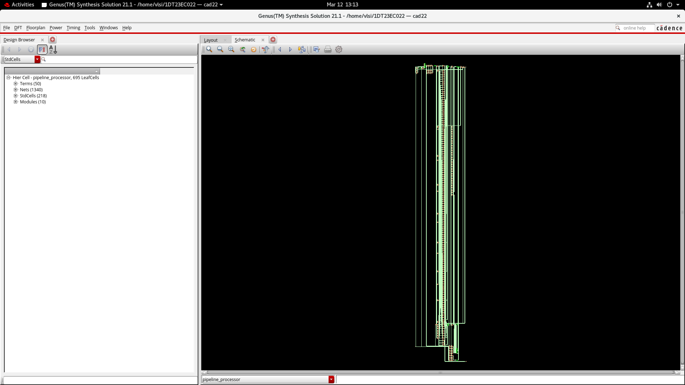
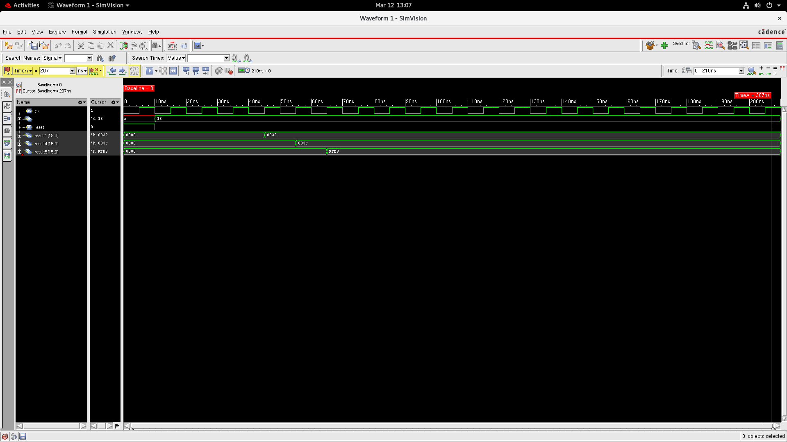

# Project 3 – Pipeline Processor Design

This project implements a **pipelined processor architecture** using **Verilog HDL** and verifies its functionality through simulation and synthesis using Cadence digital design tools.

Pipelining is a fundamental technique used in modern processors to **improve instruction throughput and overall performance** by overlapping the execution of multiple instructions. Instead of executing instructions sequentially, the processor divides execution into stages so that several instructions can be processed simultaneously.

---

# Verilog Implementation

## Pipeline Processor Module

The Verilog implementation of the processor is available in:

```
Source_code/ppl.v
```

This module describes the **pipeline architecture of the processor**, including the logic required for instruction execution across different pipeline stages.

Typical pipeline stages implemented in the design include:

- Instruction Fetch (IF)
- Instruction Decode (ID)
- Execute (EX)
- Memory Access (MEM)
- Write Back (WB)

The design allows multiple instructions to be processed concurrently at different stages of the pipeline.

---

## Testbench Code

The verification testbench is available in:

```
Source_code/ppl_tb.v
```

The testbench provides the required **stimulus signals** to simulate the processor's operation and verify that instructions pass correctly through the pipeline stages.

The testbench helps confirm that:

- Instructions move correctly between stages
- Outputs are generated at the expected clock cycles
- Pipeline execution behaves as intended

---

# Design Outputs

## Design Outputs

---

### Synthesized Processor Schematic



This schematic represents the **hardware-level implementation of the pipelined processor after synthesis**.

It shows the internal logic blocks and interconnections generated by the synthesis tool from the RTL design.  
These blocks collectively implement the pipeline stages and data flow required for instruction execution.

---


## Simulation Waveform



The simulation waveform illustrates the **execution of instructions through the pipeline stages over multiple clock cycles**.

The waveform demonstrates:

- Clock-driven instruction flow
- Overlapping execution of instructions
- Correct propagation of data through the pipeline stages

This verifies that the processor pipeline operates correctly and improves execution efficiency.

---

# Synthesis Reports

The synthesis reports provide detailed information about the **hardware characteristics and performance of the processor design**.

---

## Area Report

File:

```
Synthesis_Report/ppl_area.rep
```

This report shows the **total hardware area used by the processor design**, including the standard cell area required to implement the pipeline architecture.

Area analysis helps evaluate the **resource requirements of the processor hardware**.

---

## Gate Report

File:

```
Synthesis_Report/ppl_gate.rep
```

The gate report lists the **types and number of logic gates used in the synthesized design**.

This provides insight into the **hardware complexity and implementation structure** of the pipeline processor.

---

## Netlist

File:

```
Synthesis_Report/ppl_netlist.v
```

The netlist is the **structural representation of the synthesized circuit**, showing all gates and their interconnections.

It is typically used for **further verification or physical design steps in VLSI design flow**.

---

## Power Report

File:

```
Synthesis_Report/ppl_power.rep
```

The power report provides an estimate of the **power consumption of the processor**, including:

- Dynamic power
- Leakage power
- Total power usage

Power analysis is critical for designing **energy-efficient processors**.

---

## Timing Report

File:

```
Synthesis_Report/ppl_timing.rep
```

The timing report analyzes the **critical timing paths and propagation delays** in the processor pipeline.

It verifies whether the design satisfies the required **clock timing constraints** and ensures reliable operation at the target frequency.

---

# Tools Used

- Verilog HDL
- Cadence Digital Design Tools
- RTL Design and Synthesis
- Digital VLSI Design Methodology

---

# Learning Outcomes

Through this project, the following concepts were explored:

- Processor pipeline architecture
- Instruction-level parallelism
- RTL design using Verilog
- Testbench-based verification
- Hardware synthesis and performance analysis
- Timing, area, and power evaluation

---

# Author

**Dhruthi S**  
B.E. Electronics and Communication Engineering
