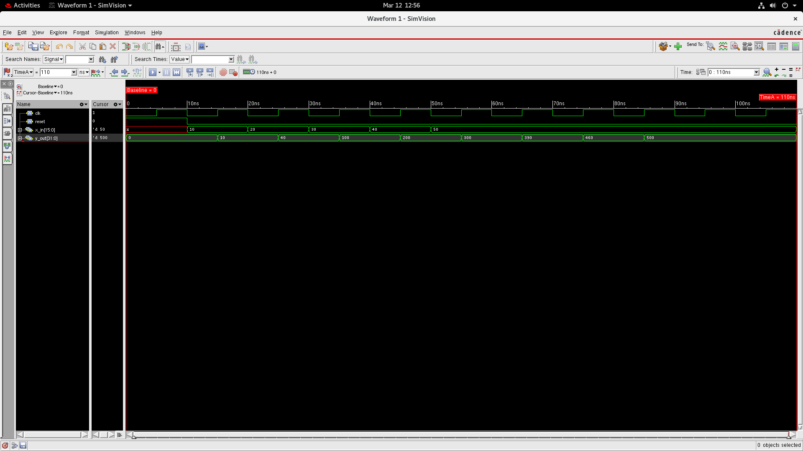
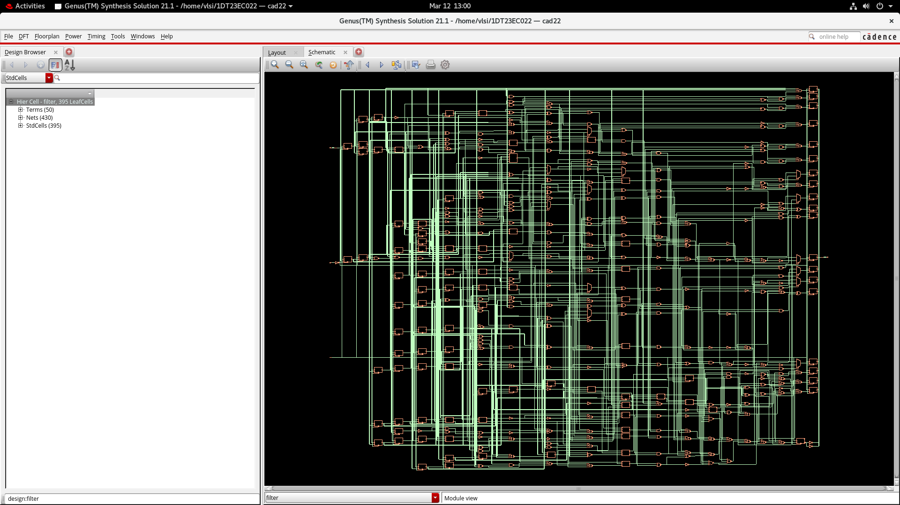

# Digital Filter Design using Verilog

## Overview
This project demonstrates the **design and implementation of a Digital Filter using Verilog HDL** following a simplified **Digital VLSI design flow**.

The filter is designed at the **Register Transfer Level (RTL)**, verified through **simulation using a testbench**, and then synthesized to generate reports related to **area, power, timing, and gate-level implementation**.

The repository includes:
- RTL design files
- Testbench for simulation
- Simulation waveform output
- Synthesized schematic
- Detailed synthesis reports

This project provides a practical understanding of the **RTL → Simulation → Synthesis workflow used in digital IC design**.

---

# Project Directory Structure

```
Project 4 - Digital filter Design
│
├── Source_code
│   ├── filter.v
│   └── filter_tb.v
│
├── DigitalFilter_Output
│   ├── DigitalFilter_Schematic.png
│   └── DigitalFilter_Simulation_waveform.png
│
├── Synthesis_Report
│   ├── filter_area.rep
│   ├── filter_gate.rep
│   ├── filter_netlist.v
│   ├── filter_power.rep
│   └── filter_timing.rep
│
└── README.md
```

---

# Source Code

## RTL Design

### `Source_code/filter.v`

This file contains the **Verilog RTL implementation of the Digital Filter**.

The module defines:
- Input signals
- Output signals
- Internal logic for filtering operation

This RTL description represents the **functional behavior of the digital filter**, which can later be synthesized into logic gates.

Example reference:

```verilog
Source_code/filter.v
```

---

## Testbench

### `Source_code/filter_tb.v`

This file contains the **testbench used for functional simulation** of the filter design.

The testbench performs the following operations:

- Generates clock signals
- Provides input stimulus to the filter
- Observes and records output responses
- Verifies correctness of the filter functionality

Example reference:

```verilog
Source_code/filter_tb.v
```

---

# Simulation Output

Simulation results are stored inside:

```
DigitalFilter_Output/
```

## Simulation Waveform

### `DigitalFilter_Output/DigitalFilter_Simulation_waveform.png`

The waveform below shows the **functional verification of the digital filter**.

It illustrates:
- Input signal transitions
- Filter processing behavior
- Output response over time



Waveform analysis helps confirm that the **RTL design behaves correctly before synthesis**.

---

## Synthesized Schematic

### `DigitalFilter_Output/DigitalFilter_Schematic.png`

The following schematic represents the **hardware implementation of the filter after synthesis**.



The schematic provides insight into how the RTL design is mapped into:

- Logic gates
- Flip-flops
- Combinational blocks

This helps visualize the **structural implementation of the digital filter**.

---

# Synthesis Reports

All synthesis results are stored in:

```
Synthesis_Report/
```

These reports are generated after converting the RTL design into a **gate-level implementation** using a synthesis tool.

---

## Area Report

### `Synthesis_Report/filter_area.rep`

This report provides information about **hardware resource utilization**, including:

- Total cell area
- Gate count
- Resource distribution

Example reference:

```
Synthesis_Report/filter_area.rep
```

Area analysis helps designers understand **hardware cost and chip utilization**.

---

## Gate-Level Report

### `Synthesis_Report/filter_gate.rep`

This report lists the **standard cells and logic gates used** in the synthesized design.

Example reference:

```
Synthesis_Report/filter_gate.rep
```

It shows how the RTL design has been converted into **basic hardware components**.

---

## Synthesized Netlist

### `Synthesis_Report/filter_netlist.v`

This file contains the **gate-level netlist generated after synthesis**.

Example reference:

```verilog
Synthesis_Report/filter_netlist.v
```

The netlist describes the circuit in terms of **interconnected gates and standard cells**, which can be used for:

- Gate-level simulation
- Timing verification
- Physical design stages

---

## Power Report

### `Synthesis_Report/filter_power.rep`

This report provides an estimate of the **power consumption of the digital filter**.

Example reference:

```
Synthesis_Report/filter_power.rep
```

Power analysis includes:

- Dynamic power
- Leakage power
- Total estimated power

This is especially important for **low-power and embedded system designs**.

---

## Timing Report

### `Synthesis_Report/filter_timing.rep`

This report provides **timing analysis results** for the synthesized design.

Example reference:

```
Synthesis_Report/filter_timing.rep
```

It includes:

- Critical path delay
- Setup and hold timing checks
- Timing constraint verification

Timing analysis ensures that the design meets the **required performance specifications**.

---

# Tools Used

The following tools and technologies were used in this project:

- **Verilog HDL** – Hardware description language used for RTL design
- **Simulation Tools** – Used for functional verification and waveform analysis
- **Synthesis Tools** – Used to convert RTL code into gate-level implementation
- **Waveform Viewer** – Used to observe signal transitions during simulation

These tools collectively form the **foundation of modern digital VLSI design workflows**.

---

# Design Flow

The project follows the typical **RTL-to-Gate design flow** used in digital IC development.

1. **RTL Design**  
   Writing the digital filter logic using Verilog HDL.

2. **Testbench Development**  
   Creating a verification environment to test the design.

3. **Functional Simulation**  
   Running simulations and analyzing waveform outputs.

4. **RTL Synthesis**  
   Converting RTL code into a gate-level hardware representation.

5. **Report Generation**  
   Producing reports for area, power, and timing analysis.

6. **Design Analysis**  
   Evaluating performance and resource utilization of the synthesized circuit.

---

# Applications

Digital filters are widely used in several engineering fields, including:

- Digital Signal Processing (DSP)
- Communication Systems
- Audio Processing
- Image Processing
- Biomedical Signal Processing
- Embedded Systems

They play a crucial role in **improving signal quality and extracting useful information from raw data**.

---

# Author

**Dhruthi Sridhar**  
Electronics and Communication Engineering (ECE)
